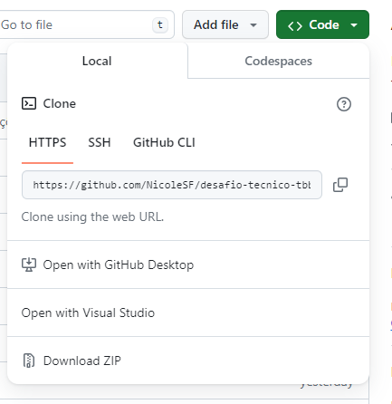

# 💻 Desafio Técnico The Brooklyn Brothers

## Como rodar este desafio localmente?

- Na página principal do repositório, clique no botão verde '<> Code' e copie o link HTTPS, como mostrado abaixo:


- Após, ir em um local de preferência do seu computador e iniciar o git bash. Dentro dele, colocar:

```
git clone https://github.com/NicoleSF/desafio-tecnico-tbb.git
```

- Depois de clonado o repositório, abrir o projeto no vscode e, no terminal, instalar as dependências com:

```
npm install
```

- Assim que a instalação terminar, para rodar a aplicação, basta digitar no terminal:

```
npm run dev
```

## 📓 Tecnologias utilizadas

- Para este desafio técnico, utilizei Vite + React, react-icons, typescript e CSS.


